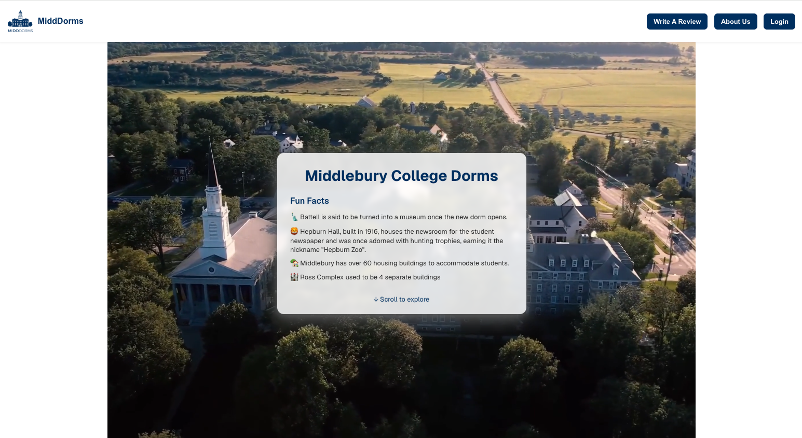
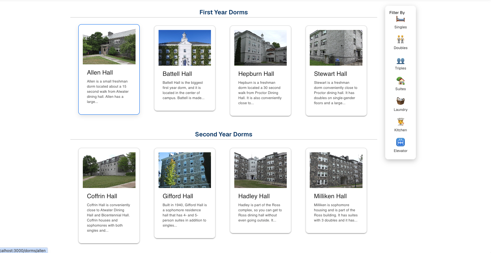
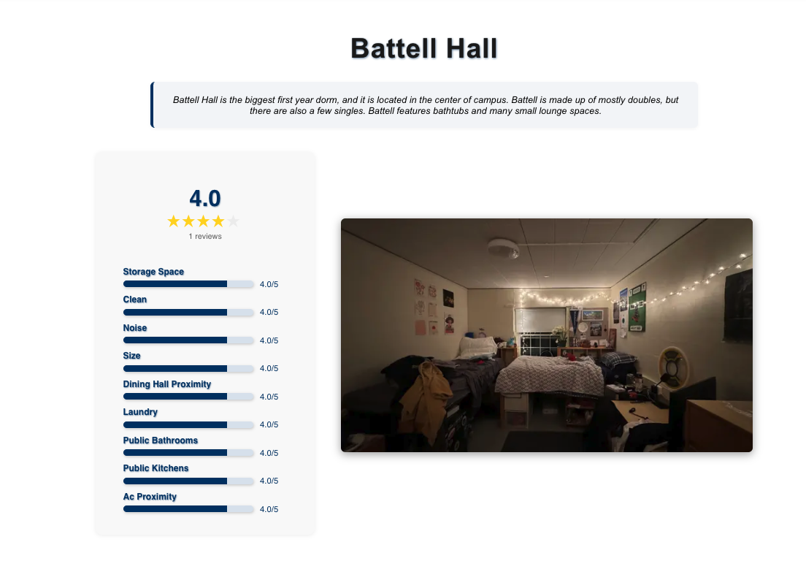
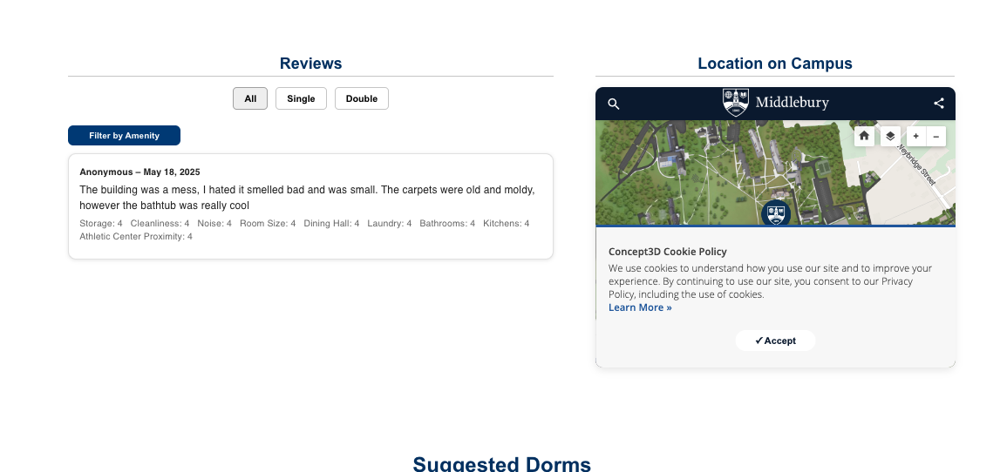
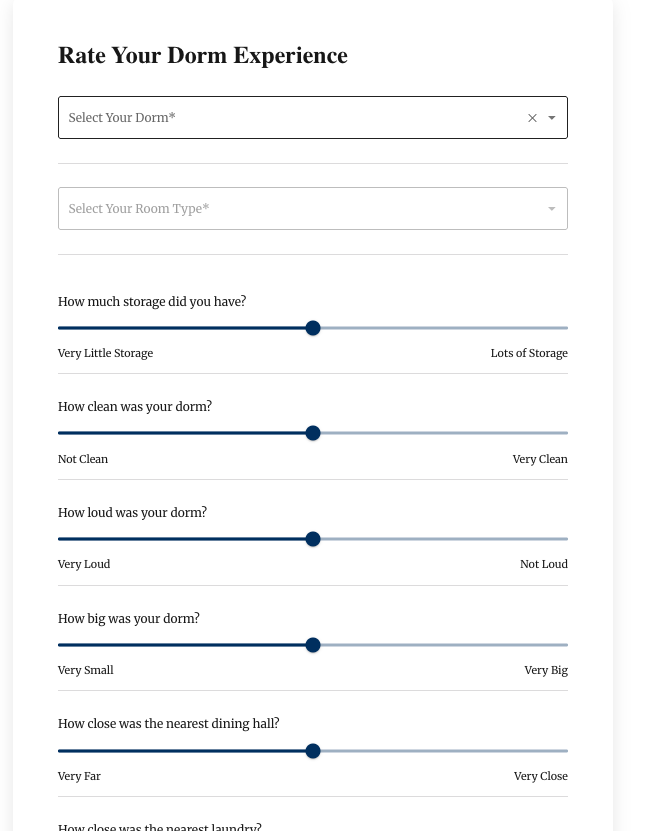

# MiddDorms — Campus Housing Rating Platform

A full-stack web application that allows Middlebury College students to browse, rate, and review campus dormitories — helping students make more informed choices during room selection.

> Built with a 5-person engineering team using Agile Scrum methodology (Spring 2025)

---

## Screenshots

### Home Page



### Browse Dorms



### Dorm Detail & Ratings



### Student Reviews & Campus Map



### Write a Review



---

## What It Does

Students can browse all campus dorms organized by year (First Year, Second Year, etc.), filter by room type and amenities, and view per-dorm ratings across storage, cleanliness, noise, size, dining hall proximity, laundry, bathrooms, kitchens, and AC proximity. Reviews are anonymous and filterable by room type. Each dorm page also shows a live campus map pin via the Middlebury Concept3D map.

Authentication is handled via Google OAuth so only Middlebury students can contribute reviews.

---

## Tech Stack

| Layer    | Technology                                      |
| -------- | ----------------------------------------------- |
| Frontend | Next.js, React, MUI (Material UI)               |
| Backend  | Node.js, Next.js API routes                     |
| Database | PostgreSQL via Knex.js (dev), Neon (production) |
| Auth     | Google OAuth                                    |
| Testing  | Jest, Testing Library                           |
| CI/CD    | GitHub Actions                                  |

---

## Project Structure

```
midd-dorms/
├── src/                  # Next.js pages and components
├── models/               # Database models
├── knex/                 # Migrations and seeds
├── data/                 # Seed data
├── public/               # Static assets
└── __mocks__/            # Jest mocks
```

---

## Local Setup

**Install dependencies:**

```bash
pnpm install
```

**Set up the database:**

```bash
npm exec knex migrate:rollback
npm exec knex migrate:latest
npm exec knex seed:run
```

**Run the development server:**

```bash
npm run dev
```

**Run tests:**

```bash
npm test
```

---

## Deployment

The app requires two environment variables:

- `GOOGLE_CLIENT_ID` — Google OAuth client ID for authentication
- `DATABASE_URL` — Connection string for a cloud PostgreSQL database (Neon recommended)

---

## Contributors

Built by a 5-person team at Middlebury College.  
[William Zambito](https://github.com/ZambitoW) — Backend architecture, database schema design, Google OAuth integration, profile page, Agile Scrum lead
